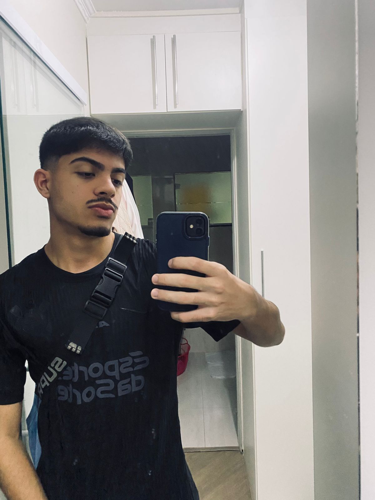

# API 3º Semestre BD
# LizardsDBA - <NOME_DO_PROJETO>

      

  | <a href ="#desafio"> Desafio</a>  |        
  <a href ="#solução"> Solução</a>  |   
  <a href ="#backlog-do-produto"> Backlog do Produto</a>  |
  <a href ="#dor---definition-of-ready">DoR</a>  |
  <a href ="#dod---definition-of-done">DoD</a>  |
  <a href ="#cronograma-de-sprints"> Cronograma de Sprints</a>  |
  <a href = "#vídeo-de-apresentação"> Vídeo de apresentação</a> |
  <a href ="#tecnologias-utilizadas">Tecnologias</a> |
  <a href ="#manuais">Manuais</a> |
  <a href ="#equipe"> Equipe</a> |

## Título do projeto
#### <TITULO_DO_PROJETO>

## Desafio
<DESCRICAO_DO_DESAFIO>

## Solução
<SOLUCAO>

---

## Backlog do Produto
<BACKLOG_DO_PRODUTO>

---

## DoR - Definition of Ready

<DOR>

## DoD - Definition of Done

<DOD>

---

## Cronograma de Sprints
| Sprint | Período | Documentação |
| :----- | :------: | :----------- |
| 🔴 **KICK-OFF GERAL** | 02/03 - 06/03 |  |
| 🔴 **CONSTRUÇÃO DO BACKLOG DE PRODUTO / PLANNING** | 09/03 - 13/03 |  |
| 🔴 **SPRINT 1** | 16/03 - 05/04 | [Sprint 1](./docs/processo/sprints/sprint-1/README.md) |
| 🔴 **SPRINT 1 REVIEW/PLANNING** | 06/04 - 10/04 | [Sprint 1](./docs/processo/sprints/sprint-1/README.md) |
| 🔴 **SPRINT 2** | 13/04 - 03/05 | [Sprint 2](./docs/processo/sprints/sprint-2/README.md) |
| 🔴 **SPRINT 2 REVIEW/PLANNING** | 04/05 - 08/05 | [Sprint 2](./docs/processo/sprints/sprint-2/README.md) |
| 🔴 **SPRINT 3** | 11/05 - 31/05 | [Sprint 3](./docs/processo/sprints/sprint-3/README.md) |
| 🔴 **SPRINT 3 REVIEW/PLANNING** | 01/06 - 05/06 | [Sprint 3](./docs/processo/sprints/sprint-3/README.md) |

---

## Vídeo de apresentação
Link: <URL_DO_VIDEO>

---

## Tecnologias Utilizadas
<TECNOLOGIAS_UTILIZADAS>

---

## Manuais
[Manual do Usuário e Técnico](docs/manuais/)

---

## Equipe
<table>
  <tr>
    <th>Membro</th>
    <th>Função</th>
    <th>Github</th>
    <th>Linkedin</th>
    <th>Foto</th>
  </tr>
  <tr>
    <td>Fagner Nascimento</td>
    <td>Product Owner</td>
    <td></td>
    <td></td>
    <td></td>
  </tr>
  <tr>
    <td>Flávio Pereira</td>
    <td>Scrum Master</td>
    <td></td>
    <td></td>
    <td></td>
  </tr>  
  <tr>
    <td>Benjamin Marques</td>
    <td>Desenvolvedor</td>
    <td></td>
    <td></td>
    <td></td>
  </tr>  
  <tr>
    <td>Brenda Bettini</td>
    <td>Desenvolvedor</td>
    <td></td>
    <td></td>
    <td>
  </td>
  </tr> 
    <tr>
    <td>Cauã Mohor</td>
    <td>Desenvolvedor</td>
    <td></td>
    <td></td>
    <td></td>
  </tr> 
  <tr>
    <td>Lucas Castro</td>
    <td>Desenvolvedor</td>
    <td></td>
    <td></td>
    <td></td>
  </tr>
  <tr>
    <td>Luiz Gustavo</td>
    <td>Desenvolvedor</td>
    <td></td>
    <td></td>
    <td></td>
  </tr>
  <tr>
    <td>Matheus de Paula</td>
    <td>Desenvolvedor</td>
    <td></td>
    <td></td>
    <td></td>
  </tr>
  <tr>
    <td>Richard Rangel</td>
    <td>Desenvolvedor</td>
    <td></td>
    <td></td>
    <td></td>
  </tr>
</table>

---

## Requisitos de Permanência
Conversamos sobre alguns pontos importantes para que ninguém seja retirado do grupo, e eles podem se atualizar durante o desenvolvimento do projeto:

- Reuniões fixas: Participar das reuniões definidas pelo grupo. Caso não possa comparecer, avisar com antecedência e se atualizar depois.
- Ferramenta de Gestão: Manter sempre o backlog atualizado no Jira, registrando tarefas, progresso e conclusão.
- Comunicação: Sempre se comunicar com o grupo pelo WhatsApp ou pessoalmente para alinhar mudanças, tirar dúvidas e informar dificuldades.
- Prazos: Atentar-se aos prazos definidos. O projeto é importante para a conclusão do 3º semestre.
- Responsabilidade individual: Cada integrante é responsável pelas tarefas que assumir.
- Participação ativa: Contribuir com ideias, desenvolvimento, testes e documentação.
- Comprometimento: Evitar deixar tarefas acumularem ou depender constantemente de outros membros.
- Aviso prévio de problemas: Caso tenha dificuldades pessoais ou técnicas, comunicar o grupo o quanto antes.
