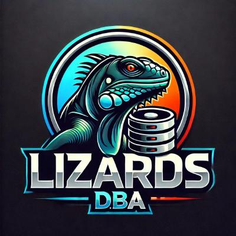

# API 3º Semestre BD
# LizardsDBA - FlowTrack

      

  | <a href ="#desafio"> Desafio</a>  |        
  <a href ="#solução"> Solução</a>  |   
  <a href ="#backlog-do-produto"> Backlog do Produto</a>  |
  <a href ="#dor---definition-of-ready">DoR</a>  |
  <a href ="#dod---definition-of-done">DoD</a>  |
  <a href ="#cronograma-de-sprints"> Cronograma de Sprints</a>  |
  <a href = "#vídeo-de-apresentação"> Vídeo de apresentação</a> |
  <a href ="#tecnologias-utilizadas">Tecnologias</a> |
  <a href ="#manuais">Manuais</a> |
  <a href ="#equipe"> Equipe</a> |

## Título do projeto
#### Sistema de Gestão de Utilização, Abastecimento e Manutenção de Viaturas – FlowTrack

## Desafio
O desafio consiste no desenvolvimento de um sistema web para controle e análise dos abastecimentos das viaturas do IPEM – Regional de São José dos Campos, substituindo o atual processo manual realizado por meio de pranchetas físicas mantidas nos veículos. Atualmente, os técnicos registram informações como quilometragem, litros abastecidos, valor pago e número da nota fiscal de forma manual, o que dificulta a consolidação mensal dos dados, a análise comparativa entre viaturas e o acompanhamento do consumo médio de combustível. A proposta do projeto é digitalizar esses registros, garantindo maior organização, rastreabilidade e confiabilidade das informações, além de permitir a geração de indicadores gerenciais que apoiem a tomada de decisão e facilitem a consolidação dos dados para posterior inserção no SGI.

## Solução
FlowTrack — Plataforma de Controle de Abastecimento e Utilização de Viaturas.
O FlowTrack permitirá o registro digital da utilização de viaturas, substituindo o controle manual realizado em pranchetas. A solução possibilita registrar abastecimentos, início e término de uso dos veículos, mantendo histórico completo de quilometragem, consumo e despesas. Além disso, contará com gerenciamento de cadastros, avisos de manutenção preventiva baseados em quilometragem e visualização de indicadores e relatórios consolidados, facilitando o acompanhamento da frota e a organização das informações para posterior inserção no SGI.

---

## Backlog do Produto

| RANK | PRIORIDADE | USER STORY                                                                                                                                                                              | STORY POINTS | SPRINT | STATUS |
| ---- | ---------- | --------------------------------------------------------------------------------------------------------------------------------------------------------------------------------------- | ------------ | ------ | ------ |
| 1    | Alta       | Como técnico, eu quero registrar um abastecimento informando viatura, quilometragem, litros, valor e número da nota fiscal, para substituir o registro manual da prancheta.             | 5            | 1      | ⏳      |
| 2   | Alta      | Como administrador, eu quero gerenciar os cadastros do sistema (usuários, viaturas, tipos de combustível, tipos de serviço, tipos de despesa e intervalos de manutenção), para manter as informações necessárias para o funcionamento da aplicação atualizadas e organizadas. | 5            | 1      | ⏳      |
| 3    | Alta      | Como administrador, eu quero uma forma de comprovar o valor gasto no abastecimento. | 5            | 1      | ⏳      |
| 4    | Média       | Como administrador, eu quero que o técnico inicie o uso de uma viatura informando prefixo, quilometragem inicial, data e finalidade do deslocamento, para registrar o início da utilização.     | 5            | 2      | ⏳      |
| 5    | Média       | Como administrador, eu quero que o tecnico encerre o uso da viatura informando a quilometragem final, para registrar o término da utilização e calcular a quilometragem percorrida.                        | 3            | 2      | ⏳      |
| 6    | Média      | Como administrador, eu quero consultar o histórico completo de utilização das viaturas (saídas, retornos e abastecimentos), para permitir auditoria e acompanhamento dos registros.     | 5            | 2      | ⏳      |
| 7    | Baixa      | Como administrador, eu quero receber avisos de manutenção preventiva quando a quilometragem da viatura atingir determinados intervalos, para apoiar o controle de revisão dos veículos. | 5            | 3      | ⏳      |
| 8    | Baixa      | Como administrador, eu quero ter visibilidade de indicadores como: Consumo médio, quilometragem percorrida e gastos por viatura, para facilitar a análise gerencial.               | 8            | 3      | ⏳      |
| 9   | Baixa      | Como administrador, eu quero gerar relatórios consolidados de utilização e abastecimento das viaturas, para facilitar o envio das informações ao SGI.                                   | 5            | 3      | ⏳      |

---

## DoR - Definition of Ready

* User Stories com Critérios de Aceitação definidos
* Tarefas técnicas quebradas a partir das User Stories
* Modelagem inicial do Banco de Dados (tabelas: usuario, viatura, abastecimento)
* Protótipo da tela de cadastro de abastecimento
* User Stories validadas com o parceiro
* Sem dependências externas bloqueando o desenvolvimento

## DoD - Definition of Done

* Manual de Usuário atualizado
* Manual Técnico atualizado
* Código versionado no GitHub com PR revisado
* Funcionalidade operacional e testada
* Validação de dados funcionando conforme critérios de aceitação
* Banco de dados atualizado e documentado (MER + Dicionário de Dados)

---

## Cronograma de Sprints
| Sprint | Período | Documentação |
| :----- | :------: | :----------- |
| 🟢 **KICK-OFF GERAL** | 02/03 - 06/03 |  |
| 🟢 **CONSTRUÇÃO DO BACKLOG DE PRODUTO / PLANNING** | 09/03 - 13/03 |  |
| 🔴 **SPRINT 1** | 16/03 - 05/04 | [Sprint 1](./docs/processo/sprints/sprint-1/README.md) |
| 🔴 **SPRINT 1 REVIEW/PLANNING** | 06/04 - 10/04 | [Sprint 1](./docs/processo/sprints/sprint-1/README.md) |
| 🔴 **SPRINT 2** | 13/04 - 03/05 | [Sprint 2](./docs/processo/sprints/sprint-2/README.md) |
| 🔴 **SPRINT 2 REVIEW/PLANNING** | 04/05 - 08/05 | [Sprint 2](./docs/processo/sprints/sprint-2/README.md) |
| 🔴 **SPRINT 3** | 11/05 - 31/05 | [Sprint 3](./docs/processo/sprints/sprint-3/README.md) |
| 🔴 **SPRINT 3 REVIEW/PLANNING** | 01/06 - 05/06 | [Sprint 3](./docs/processo/sprints/sprint-3/README.md) |
| 🔴 **FEIRA DE SOLUÇÕES** | 18/06 |  |

---

## Vídeo de apresentação
Link: <URL_DO_VIDEO>

---

## Tecnologias Utilizadas
<TECNOLOGIAS_UTILIZADAS>

---

## Manuais
[Manual do Usuário e Técnico](docs/manuais/)

---

## Equipe
<table>
  <tr>
    <th>Membro</th>
    <th>Função</th>
    <th>Github</th>
    <th>Linkedin</th>
    <th>Foto</th>
  </tr>
  <tr>
    <td>Fagner Nascimento</td>
    <td>Product Owner</td>
    <td></td>
    <td></td>
    <td></td>
  </tr>
  <tr>
    <td>Flávio Pereira</td>
    <td>Scrum Master</td>
    <td></td>
    <td></td>
    <td></td>
  </tr>  
  <tr>
    <td>Benjamin Marques</td>
    <td>Desenvolvedor</td>
    <td></td>
    <td></td>
    <td></td>
  </tr>  
  <tr>
    <td>Brenda Bettini</td>
    <td>Desenvolvedor</td>
    <td></td>
    <td></td>
    <td>
  </td>
  </tr> 
    <tr>
    <td>Cauã Mohor</td>
    <td>Desenvolvedor</td>
    <td></td>
    <td></td>
    <td></td>
  </tr> 
  <tr>
    <td>Lucas Castro</td>
    <td>Desenvolvedor</td>
    <td></td>
    <td></td>
    <td></td>
  </tr>
  <tr>
    <td>Luiz Gustavo</td>
    <td>Desenvolvedor</td>
    <td></td>
    <td></td>
    <td></td>
  </tr>
  <tr>
    <td>Matheus de Paula</td>
    <td>Desenvolvedor</td>
    <td></td>
    <td></td>
    <td></td>
  </tr>
  <tr>
    <td>Richard Rangel</td>
    <td>Desenvolvedor</td>
    <td></td>
    <td></td>
    <td></td>
  </tr>
</table>

---

## Requisitos de Permanência
Conversamos sobre alguns pontos importantes para que ninguém seja retirado do grupo, e eles podem se atualizar durante o desenvolvimento do projeto:

- Reuniões fixas: Participar das reuniões definidas pelo grupo. Caso não possa comparecer, avisar com antecedência e se atualizar depois.
- Ferramenta de Gestão: Manter sempre o backlog atualizado no Jira, registrando tarefas, progresso e conclusão.
- Comunicação: Sempre se comunicar com o grupo pelo WhatsApp ou pessoalmente para alinhar mudanças, tirar dúvidas e informar dificuldades.
- Prazos: Atentar-se aos prazos definidos. O projeto é importante para a conclusão do 3º semestre.
- Responsabilidade individual: Cada integrante é responsável pelas tarefas que assumir.
- Participação ativa: Contribuir com ideias, desenvolvimento, testes e documentação.
- Comprometimento: Evitar deixar tarefas acumularem ou depender constantemente de outros membros.
- Aviso prévio de problemas: Caso tenha dificuldades pessoais ou técnicas, comunicar o grupo o quanto antes.
