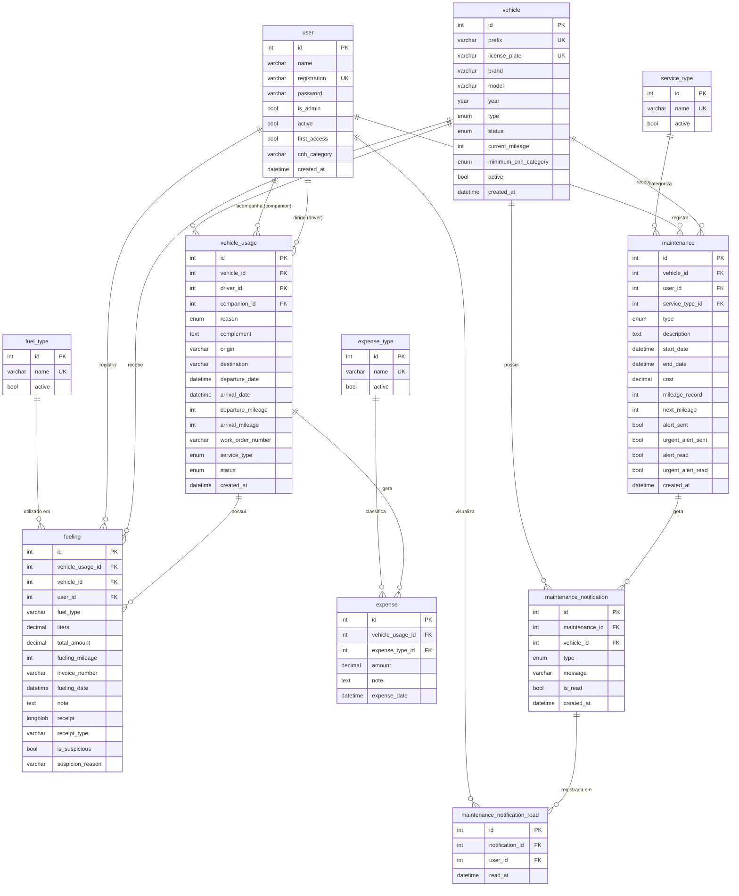

# Dicionário de Dados - Flowtrack

> Documentação da estrutura do banco de dados relacional (MySQL) da aplicação Flowtrack contendo tabelas, tipos de dados e restrições.

---

## 1. Tabela `user`

Armazena os motoristas, técnicos e o administrador do sistema.

| Atributo       | Tipo de Dado | Restrição / Chave | Descrição                                                           |
| :------------- | :----------- | :---------------- | :------------------------------------------------------------------ |
| `id`           | INT          | PK, Auto Inc.     | Chave primária. Identificador único do usuário.                     |
| `name`         | VARCHAR(100) | NOT NULL          | Nome completo do usuário.                                           |
| `registration` | VARCHAR(20)  | NOT NULL, UNIQUE  | Código/login de acesso único para entrar no sistema.                |
| `password`     | VARCHAR(255) | NOT NULL          | Senha de acesso encriptada.                                         |
| `is_admin`     | BOOLEAN      | DEFAULT FALSE     | Define o nível de permissão (true = Gestor, false = Técnico comum). |
| `active`       | BOOLEAN      | DEFAULT TRUE      | Status da conta (soft delete).                                      |
| `first_access` | BOOLEAN      | DEFAULT TRUE      | Flag indicando se o usuário deverá trocar a senha.                  |
| `cnh_category` | VARCHAR(20)  | DEFAULT 'B'       | Categoria da CNH do usuário (ex: A, B, C, D, E).                    |
| `created_at`   | DATETIME     | DEFAULT NOW()     | Data de registro no sistema.                                        |

---

## 2. Tabela `vehicle`

Armazena a frota de veículos.

| Atributo               | Tipo de Dado | Restrição / Chave    | Descrição                                                                      |
| :--------------------- | :----------- | :------------------- | :----------------------------------------------------------------------------- |
| `id`                   | INT          | PK, Auto Inc.        | Chave primária.                                                                |
| `prefix`               | VARCHAR(20)  | NOT NULL, UNIQUE     | Numeração ou identificador interno da empresa.                                 |
| `license_plate`        | VARCHAR(10)  | NOT NULL, UNIQUE     | Placa do veículo.                                                              |
| `brand`                | VARCHAR(50)  | NOT NULL             | Fabricante do carro (ex: Fiat).                                                |
| `model`                | VARCHAR(50)  | NOT NULL             | Modelo do carro (ex: Strada).                                                  |
| `year`                 | YEAR         | NOT NULL             | Ano de fabricação do veículo.                                                  |
| `type`                 | ENUM         | NOT NULL             | ('UTILITARIO', 'PASSEIO') Categoria do veículo.                                |
| `status`               | ENUM         | DEFAULT 'DISPONIVEL' | Situação atual ('DISPONIVEL', 'EM_USO', 'INDISPONIVEL').                       |
| `current_mileage`      | INT          | DEFAULT 0            | Quilometragem atual da viatura.                                                |
| `minimum_cnh_category` | ENUM         | DEFAULT 'B'          | Categoria mínima de CNH exigida para conduzir o veículo ('A','B','C','D','E'). |
| `active`               | BOOLEAN      | DEFAULT TRUE         | Status ativo (soft delete).                                                    |
| `created_at`           | DATETIME     | DEFAULT NOW()        | Data de registro no sistema.                                                   |

---

## 3. Tabela `expense_type`

Cadastro das categorias de despesas que podem ser associadas a um uso de viatura.

| Atributo | Tipo de Dado | Restrição / Chave | Descrição                                                   |
| :------- | :----------- | :---------------- | :---------------------------------------------------------- |
| `id`     | INT          | PK, Auto Inc.     | Chave primária.                                             |
| `name`   | VARCHAR(50)  | NOT NULL, UNIQUE  | Nome da categoria de despesa (ex: Pedágio, Estacionamento). |
| `active` | BOOLEAN      | DEFAULT TRUE      | Disponibilidade da categoria.                               |

---

## 4. Tabela `fuel_type`

Cadastro das opções de combustíveis para abastecer os veículos.

| Atributo | Tipo de Dado | Restrição / Chave | Descrição                                                     |
| :------- | :----------- | :---------------- | :------------------------------------------------------------ |
| `id`     | INT          | PK, Auto Inc.     | Chave primária.                                               |
| `name`   | VARCHAR(50)  | NOT NULL, UNIQUE  | Descrição do combustível (Gasolina, Etanol, Diesel S10, etc). |
| `active` | BOOLEAN      | DEFAULT TRUE      | Disponibilidade do combustível.                               |

---

## 5. Tabela `vehicle_usage`

Registra cada uso/viagem de uma viatura, com motorista, finalidade e quilometragem.

| Atributo            | Tipo de Dado | Restrição / Chave   | Descrição                                                                                                                                                                 |
| :------------------ | :----------- | :------------------ | :------------------------------------------------------------------------------------------------------------------------------------------------------------------------ |
| `id`                | INT          | PK, Auto Inc.       | Chave primária.                                                                                                                                                           |
| `vehicle_id`        | INT          | FK `vehicle(id)`    | Veículo utilizado na viagem.                                                                                                                                              |
| `driver_id`         | INT          | FK `user(id)`       | Motorista responsável pelo uso da viatura.                                                                                                                                |
| `companion_id`      | INT          | FK `user(id)`, NULL | Acompanhante opcional.                                                                                                                                                    |
| `reason`            | ENUM         | NOT NULL            | Finalidade da viagem: 'ADMINISTRATIVO', 'AUDITORIA', 'ENSAIO', 'FISCALIZACAO', 'INSPECAO', 'INSPETORIA', 'JURIDICO', 'OFICINA', 'SUPERVISAO', 'TRANSLADO', 'VERIFICACAO'. |
| `complement`        | TEXT         | NULL                | Informações complementares sobre a finalidade.                                                                                                                            |
| `origin`            | VARCHAR(255) | NULL                | Local de origem da viagem.                                                                                                                                                |
| `destination`       | VARCHAR(255) | NULL                | Destino principal da viagem.                                                                                                                                              |
| `departure_date`    | DATETIME     | DEFAULT NOW()       | Data e hora de saída.                                                                                                                                                     |
| `arrival_date`      | DATETIME     | NULL                | Data e hora de retorno (preenchido ao encerrar).                                                                                                                          |
| `departure_mileage` | INT          | NOT NULL            | Quilometragem no momento da saída.                                                                                                                                        |
| `arrival_mileage`   | INT          | NULL                | Quilometragem no momento do retorno.                                                                                                                                      |
| `work_order_number` | VARCHAR(20)  | NULL                | Número da ordem de serviço relacionada (opcional).                                                                                                                        |
| `service_type`      | ENUM         | NULL                | Tipo de serviço associado: 'RADAR' ou 'CALIBRACAO'.                                                                                                                       |
| `status`            | ENUM         | DEFAULT 'ABERTO'    | Situação do registro: 'ABERTO', 'ENCERRADO' ou 'CANCELADO'.                                                                                                               |
| `created_at`        | DATETIME     | DEFAULT NOW()       | Data de criação do registro.                                                                                                                                              |

---

## 6. Tabela `fueling`

Registro de todos os abastecimentos realizados nas viaturas.

| Atributo           | Tipo de Dado  | Restrição / Chave            | Descrição                                                         |
| :----------------- | :------------ | :--------------------------- | :---------------------------------------------------------------- |
| `id`               | INT           | PK, Auto Inc.                | Chave primária.                                                   |
| `vehicle_usage_id` | INT           | FK `vehicle_usage(id)`, NULL | Uso de viatura associado ao abastecimento (opcional).             |
| `vehicle_id`       | INT           | FK `vehicle(id)`             | Veículo abastecido.                                               |
| `user_id`          | INT           | FK `user(id)`                | Técnico/motorista que registrou o abastecimento.                  |
| `fuel_type`        | VARCHAR(20)   | NOT NULL                     | Nome do combustível utilizado no momento do abastecimento.        |
| `liters`           | DECIMAL(8,3)  | NOT NULL                     | Quantidade de litros abastecidos.                                 |
| `total_amount`     | DECIMAL(10,2) | NOT NULL                     | Valor total pago no abastecimento.                                |
| `fueling_mileage`  | INT           | NOT NULL                     | Quilometragem do veículo no momento do abastecimento.             |
| `invoice_number`   | VARCHAR(50)   | NULL                         | Número da nota fiscal do posto.                                   |
| `fueling_date`     | DATETIME      | DEFAULT NOW()                | Data e hora do abastecimento.                                     |
| `note`             | TEXT          | NULL                         | Observações adicionais.                                           |
| `receipt`          | LONGBLOB      | NULL                         | Imagem ou arquivo do comprovante fiscal.                          |
| `receipt_type`     | VARCHAR(50)   | NULL                         | Tipo/formato do arquivo do comprovante (ex: image/jpeg).          |
| `is_suspicious`    | BOOLEAN       | DEFAULT FALSE                | Indica se o abastecimento foi marcado como suspeito pelo sistema. |
| `suspicion_reason` | VARCHAR(255)  | NULL                         | Motivo pelo qual o abastecimento foi considerado suspeito.        |

---

## 7. Tabela `expense`

Registro de despesas avulsas associadas a um uso de viatura (ex: pedágio, estacionamento).

| Atributo           | Tipo de Dado  | Restrição / Chave      | Descrição                                  |
| :----------------- | :------------ | :--------------------- | :----------------------------------------- |
| `id`               | INT           | PK, Auto Inc.          | Chave primária.                            |
| `vehicle_usage_id` | INT           | FK `vehicle_usage(id)` | Uso de viatura ao qual a despesa pertence. |
| `expense_type_id`  | INT           | FK `expense_type(id)`  | Categoria da despesa.                      |
| `amount`           | DECIMAL(10,2) | NOT NULL               | Valor da despesa.                          |
| `note`             | TEXT          | NULL                   | Observações sobre a despesa.               |
| `expense_date`     | DATETIME      | DEFAULT NOW()          | Data e hora em que a despesa ocorreu.      |

---

## 8. Tabela `maintenance`

Registro de manutenções realizadas nas viaturas (preventivas, corretivas e outros).

| Atributo            | Tipo de Dado  | Restrição / Chave     | Descrição                                                                 |
| :------------------ | :------------ | :-------------------- | :------------------------------------------------------------------------ |
| `id`                | INT           | PK, Auto Inc.         | Chave primária.                                                           |
| `vehicle_id`        | INT           | FK `vehicle(id)`      | Veículo que recebeu a manutenção.                                         |
| `user_id`           | INT           | FK `user(id)`         | Usuário que registrou a manutenção.                                       |
| `type`              | ENUM          | NOT NULL              | Tipo da manutenção: 'PREVENTIVA', 'CORRETIVA', 'INUTILIDADE' ou 'OUTROS'. |
| `description`       | TEXT          | NOT NULL              | Descrição detalhada do serviço realizado.                                 |
| `start_date`        | DATETIME      | DEFAULT NOW()         | Data de início da manutenção.                                             |
| `end_date`          | DATETIME      | NULL                  | Data de término da manutenção (opcional).                                 |
| `cost`              | DECIMAL(10,2) | NULL                  | Custo total da manutenção.                                                |
| `mileage_record`    | INT           | NULL                  | Quilometragem do veículo no momento da manutenção.                        |
| `created_at`        | DATETIME      | DEFAULT NOW()         | Data de criação do registro.                                              |
| `service_type_id`   | INT           | FK `service_type(id)` | Tipo de serviço relacionado à manutenção.                                 |
| `next_mileage`      | INT           | NULL                  | Próxima quilometragem prevista para manutenção preventiva.                |
| `alert_sent`        | BOOLEAN       | DEFAULT FALSE         | Indica se o alerta preventivo já foi enviado.                             |
| `urgent_alert_sent` | BOOLEAN       | DEFAULT FALSE         | Indica se o alerta urgente já foi enviado.                                |
| `alert_read`        | BOOLEAN       | DEFAULT FALSE         | Indica se o alerta preventivo foi visualizado.                            |
| `urgent_alert_read` | BOOLEAN       | DEFAULT FALSE         | Indica se o alerta urgente foi visualizado.                               |

---

## 9. Tabela `service_type`

Cadastro dos tipos de serviços associados às manutenções.

| Atributo | Tipo de Dado | Restrição / Chave | Descrição                                             |
| :------- | :----------- | :---------------- | :---------------------------------------------------- |
| `id`     | INT          | PK, Auto Inc.     | Chave primária.                                       |
| `name`   | VARCHAR(100) | NOT NULL, UNIQUE  | Nome do tipo de serviço realizado.                    |
| `active` | BOOLEAN      | DEFAULT TRUE      | Define se o tipo de serviço está disponível para uso. |

---

## 10. Tabela `maintenance_notification`

Armazena notificações automáticas relacionadas às manutenções dos veículos.

| Atributo         | Tipo de Dado | Restrição / Chave    | Descrição                                 |
| :--------------- | :----------- | :------------------- | :---------------------------------------- |
| `id`             | INT          | PK, Auto Inc.        | Chave primária.                           |
| `maintenance_id` | INT          | FK `maintenance(id)` | Manutenção relacionada à notificação.     |
| `vehicle_id`     | INT          | FK `vehicle(id)`     | Veículo associado à notificação.          |
| `type`           | ENUM         | NOT NULL             | Tipo da notificação: 'ALERT' ou 'URGENT'. |
| `message`        | VARCHAR(500) | NOT NULL             | Conteúdo textual da notificação.          |
| `is_read`        | BOOLEAN      | DEFAULT FALSE        | Indica se a notificação foi lida.         |
| `created_at`     | DATETIME     | DEFAULT NOW()        | Data de criação da notificação.           |

---

## 11. Tabela `maintenance_notification_read`

Controla quais usuários visualizaram determinadas notificações de manutenção.

| Atributo          | Tipo de Dado | Restrição / Chave                 | Descrição                                      |
| :---------------- | :----------- | :-------------------------------- | :--------------------------------------------- |
| `id`              | INT          | PK, Auto Inc.                     | Chave primária.                                |
| `notification_id` | INT          | FK `maintenance_notification(id)` | Notificação visualizada pelo usuário.          |
| `user_id`         | INT          | FK `user(id)`                     | Usuário que realizou a leitura da notificação. |
| `read_at`         | DATETIME     | DEFAULT NOW()                     | Data e hora da leitura da notificação.         |

### Restrições adicionais

* `UNIQUE KEY uk_notification_user (notification_id, user_id)`

  * Garante que um mesmo usuário não registre múltiplas leituras para a mesma notificação.

---

## Modelo Lógico Relacional - Flowtrack

